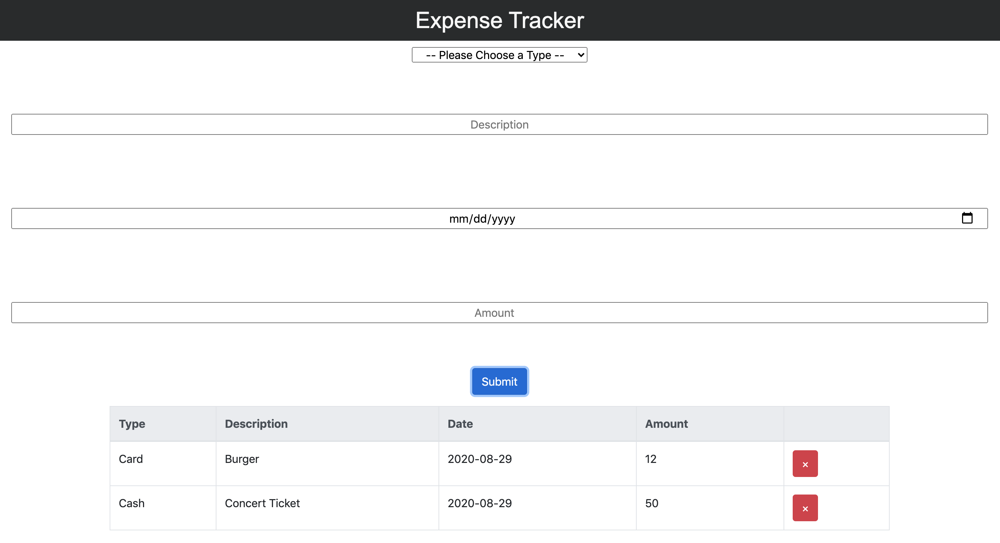

# Expense-Tracker-app
This is an Expense Tracker app written with REACT/Node.js and Bootstrap/Reactstrap and deployed with Heroku.

<strong>View application on <a href="https://expense-tracker-app01.herokuapp.com/"><b>Heroku</b></a>.</strong>

# Summary
  
  This app was designed to track all expenses and help improve spending habits. This is the first app I built using REACT and Bootstrap and has been one of my favorite projects. Even though it took some studying to understand this component based thinking, I quickly understood the power of REACT and state. The ability to break down my code into small components allowed me to to work on individual parts of my app and keep everything organized.  
  
  REACT allowed me to write HTML and manage how I wanted it to interact with my state. This app is built with class-based components, different states, and uses props to pass down data to child components. I enjoyed using NPM and seeing changes to my code in real time. Bootstrap made it easy and enjoyable to style my different components. I look forward to learning more about it's responsive framework. REACT has opened my eyes to a new way of coding and I am eager to explore more life-cycle methods and functional components with hooks.
 
# Author
<strong>Mauro Leos</strong>-<i>Full-Stack Software Developer</i>-<a href="https://www.linkedin.com/in/mauro-leos-b4103a11b/"> LinkedIn </a> - <a href="https:/https://www.mauroleos.com//">Website</a>

